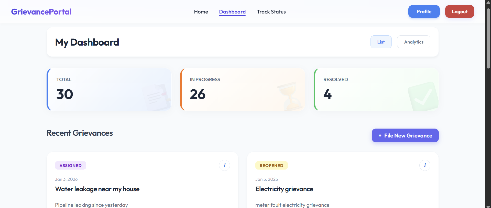
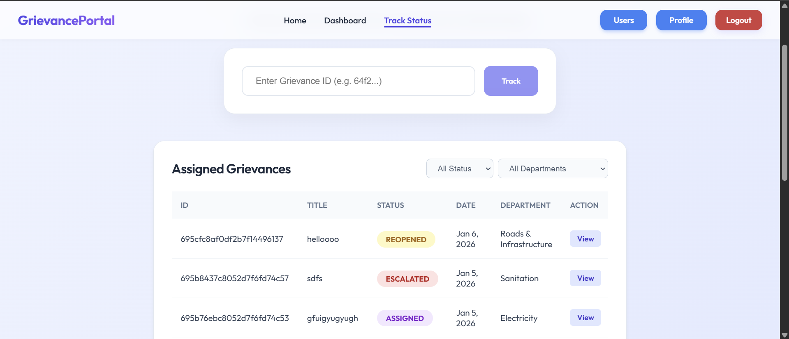
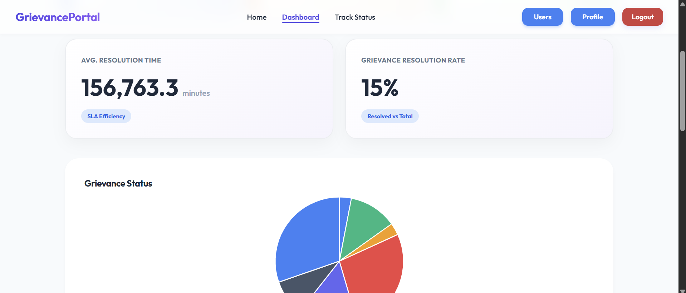

# E-Gov Grievance Redressal System

### A scalable, event-driven, full-stack microservices application designed for transparent and efficient public grievance management. Built with a Reactive Backend (Spring Boot WebFlux, Kafka) and a modern Frontend design (Angular 21).

[](https://spring.io/projects/spring-boot)
[](https://angular.io/)
[](https://www.mongodb.com/)
[](https://kafka.apache.org/)
[](https://www.oracle.com/java/)

---

### Table of Contents

- [Architecture Overview](#architecture-overview)
- [Project Resources](#project-resources)
- [Key Features](#key-features)
- [Microservices Overview](#microservices-overview)
- [Security Architecture](#security-architecture)
- [Technical Stack](#technical-stack)
- [Database Schema](#database-schema)
- [Common Commands](#common-commands)
- [CI/CD & Quality](#cicd--quality)

---

## Architecture Overview

This project implements a **Reactive Microservices Architecture**, prioritizing high performance, non-blocking I/O, and event-driven communication.


### High-Level Architecture Summary

The system is organized around a central API Gateway and Service Registry, with asynchronous communication handled by Apache Kafka for status updates and notifications.

| Component                       | Role                                                               |
| :------------------------------ | :----------------------------------------------------------------- |
| **Grievance Frontend** (4200)   | Angular-based premium UI for Citizens, Officers, and Admins        |
| **API Gateway** (8080)          | Central entry point, JWT validation, and Role-Based routing        |
| **Grievance Service** (9004)    | Core business logic: filing, assignment, and status management     |
| **User Service** (9002)         | Identity Management and RBAC (Admin, Supervisor, Officer, Citizen) |
| **Notification Service** (9006) | Kafka Consumer for sending real-time email alerts                  |
| **Reporting Service** (9007)    | Analytics, SLA breach tracking, and performance metrics            |
| **Feedback Service** (9005)     | Handles citizen feedback post-resolution                           |
| **Eureka Registry** (8761)      | Dynamic service discovery                                          |
| **Config Server** (8888)        | Centralized, Git-backed configuration management                   |

---

## Project Resources

- **Documentation:** [Project Progress & Design](https://docs.google.com/document/d/1T1QVHbWuInlHcDt8l-kJmpfIsUZskNsKu4Hq0TDC9S8/edit?usp=sharing)
- **Frontend Repository:** [EGovGrievanceFrontend](https://github.com/Yati-21/EGovGrievanceFrontend)
- **Backend Repository:** [EGovGrievanceBackend](https://github.com/Yati-21/EGovGrievanceBackend)
- **Config Server Repo:** [egov-config-repo](https://github.com/Yati-21/egov-config-repo)

---

## Key Features

- **End-to-End Tracking:** Citizens can file grievances with attachments and track status in real-time.
- **SLA-Based Escalation:** Automatic escalation to Superiors if grievances aren't resolved within defined timelines.
- **Role-Based Workflows:**
  - **Citizen:** File, Reopen, Escalate
  - **Officer:** Review and Resolve assigned grievances
  - **Supervisor:** Monitor department performance and handle escalated cases
  - **Admin:** Manage users, roles, and can view analytics
- **Event-Driven Notifications:** Real-time email alerts via Kafka for every status change

---

## UI/UX Previews

The system features UI designed for a seamless user experience across all devices

| Citizen Dashboard                  |
| :--------------------------------- |
|  |
| _All Grievances & Filing_          |

| Tracking Workflow                             |
| :-------------------------------------------- |
|  |
| _Real-time status updates with Timeline view_ |

| Analytics Dashboard                |
| :--------------------------------- |
|  |
| _Modern Analytics_                 |

---

## Microservices Overview

### Infrastructure Services

| Component           | Port   | Role & Key Features                                       |
| :------------------ | :----- | :-------------------------------------------------------- |
| **API Gateway**     | `8080` | **Reactive Gateway** handling JWT auth, rbac, and routing |
| **Eureka Registry** | `8761` | Service discovery for dynamic scaling                     |
| **Config Server**   | `8888` | Centralizes configurations from GitHub                    |

### Domain Microservices

| Component                | Port   | Primary Responsibilities             | Interaction Pattern                                     |
| :----------------------- | :----- | :----------------------------------- | :------------------------------------------------------ |
| **User Service**         | `9002` | User profiles, Authentication, RBAC  | REST (WebClient)                                        |
| **Grievance Service**    | `9004` | Grievance Lifecycle & File Storage   | **Kafka Producer**, WebClient                           |
| **Notification Service** | `9006` | Email dispatch via SMTP              | **Kafka Consumer** (Topic: `grievance-status-changed`). |
| **Reporting Service**    | `9007` | SLA Analysis & Success Rates         | Cross-service data aggregation                          |
| **Feedback Service**     | `9005` | Post-resolution citizen satisfaction | Integrates with Grievance Service                       |

### Kafka Event Flow

1. **Grievance Service** publishes a `GrievanceStatusChangedEvent` to Kafka
2. **Notification Service** consumes the event and fetches user details from **User Service**
3. **EmailService** dispatches a formatted HTML email to the Citizen/Officer/Supervisor

---

## Security Architecture

Security is enforced at the **API Gateway** level using **JWT (JSON Web Tokens)**

### 1. Authentication Flow

- **Registration/Login:** Handled by `/auth/register` and `/auth/login` (Public)
- **Token Generation:** User Service generates a JWT containing `userId` and `role`
- **Validation:** Gateway intercepts all requests, validates the signature, and extracts claims

### 2. RBAC Access Matrix

| Feature           | Endpoint                    | Method | Allowed Roles     |
| :---------------- | :-------------------------- | :----- | :---------------- |
| File Grievance    | `/grievances`               | POST   | CITIZEN           |
| Assign Officer    | `/grievances/{id}/assign`   | PUT    | ADMIN, SUPERVISOR |
| Resolve Grievance | `/grievances/{id}/resolve`  | PUT    | OFFICER           |
| Escalate          | `/grievances/{id}/escalate` | PUT    | CITIZEN           |
| User Management   | `/users/**`                 | PUT    | ADMIN             |
| Public Stats      | `/reports/public/**`        | GET    | Public            |

---

## Technical Stack

- **Backend:** Java 21, Spring Boot 3.4, Spring Cloud, Spring WebFlux (Project Reactor)
- **Communication:** Apache Kafka, REST (WebClient)
- **Persistence:** MongoDB (Distributed NoSQL)
- **Frontend:** Angular 21, RxJS, Vanilla CSS (Custom Design System)
- **Tools:** Docker, Jenkins, Maven, SonarCloud, Postman

---

## Database Schema

The system uses MongoDB for high availability and flexible data modeling.


- **Collections:** `users`, `grievances`, `grievance_history`, `grievance_documents`, `departments`, `categories`.

---

## Common Commands

**1. Run Infrastructure Only (Kafka, Zookeeper)**

```bash
docker-compose -f docker-compose-kafka.yml up -d
```

**2. Start Backend Services** 

```bash
# Run individual services or use a run script
mvn package
java -jar target/EGovGrievanceBackend-0.0.1-SNAPSHOT.jar 
```

**3. Run Frontend Server**

```bash
cd EGovGrievanceFrontend/grievance-ui
npm install
ng serve
```

---

## CI/CD & Quality

- **Pipeline:** Managed via `jenkins_pipeline.groovy` including build, test, and deploy stages
- **Quality Gate:** Integrated with **SonarCloud** for static code analysis
- **Testing:**
  - **Backend:** JUnit 5, Mockito
  - **Code Coverage:** Jacoco(90%+)
  - **API:** Postman Collection included in the repo
